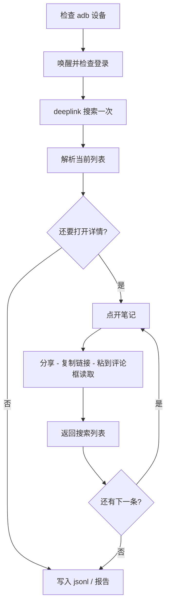

# 小红书 App ADB 标准流程

用手机上已登录的官方小红书 App 搜索、打开笔记并提取链接。  
**不走 Chrome / MediaCrawler Web 接口**，避免再把账号踢下线。

## 前置条件

1. 电脑已装 `adb`（或 macOS 默认路径 `~/Library/Android/sdk/platform-tools/adb`）
2. 手机已开 USB/无线调试，`adb devices` 能看到 `device`
3. 已安装小红书 `com.xingin.xhs`，并在 App 内登录
4. 屏幕亮着，通知栏收起

## 标准步骤（只搜一次）



| 步骤 | 做什么 | 不做什么 |
|---|---|---|
| 1 检查设备 | `adb devices` | — |
| 2 检查登录 | 打开 App，看是否有「去登录」 | 不扫网页码 |
| 3 搜索一次 | `xhsdiscover://search/result?keyword=` | 每条笔记后不再搜索 |
| 4 收集列表 | dump 当前屏，不够就下滑 | 不重新发 Intent |
| 5 打开取链 | 分享 → 复制链接 → 粘到评论框 | 不粘到顶栏搜索框 |
| 6 返回列表 | 返回键回到结果页 | 不重新搜索 |
| 7 落盘 | `data/xhs/adb/*.jsonl` + `report_*.md` | — |

## 怎么跑

```bash
cd /Users/chm/.gemini/antigravity/scratch/MediaCrawler

# 看是否登录
uv run python tools/xhs_adb.py status

# 标准流程：搜「吧唧」，打开 5 条并取链接
uv run python tools/xhs_adb.py search -k 吧唧 -p 1 --open 5

# 或用封装脚本：关键词、打开条数、滑动屏数
./scripts/xhs_adb_search.sh 吧唧 5 1
```

约束：`--pages` 1–5，`--open` 0–10。一次打开过多容易触发 App 风控。

## 输出

| 文件 | 内容 |
|---|---|
| `data/xhs/adb/search_{关键词}_{日期}.jsonl` | 列表卡片 |
| `data/xhs/adb/detail_{关键词}_{日期}.jsonl` | 详情 + 短链 + explore 链接 |
| `data/xhs/adb/report_{关键词}_{日期}.md` | 可读报告 |

`search_intents` 必须为 **1**。如果大于 1，说明流程被破坏、又重新搜了。

## 代码入口

- 编排：`tools/adb_xhs/pipeline.py` → `XhsAdbPipeline.run()`
- 单步操作：`tools/adb_xhs/xhs_app.py` → `XhsAdbApp`
- 设备：`tools/adb_xhs/device.py` → `AdbDevice`
- CLI：`tools/xhs_adb.py`
- Shell：`scripts/xhs_adb_search.sh`
